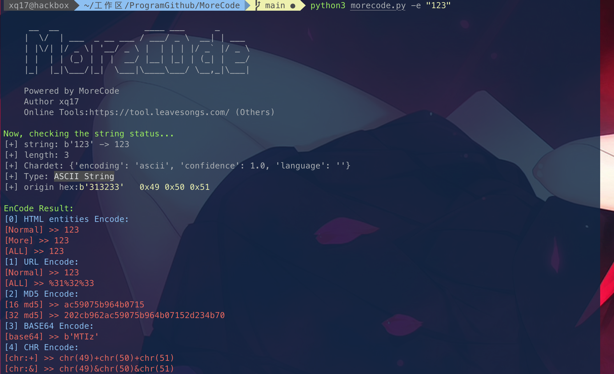
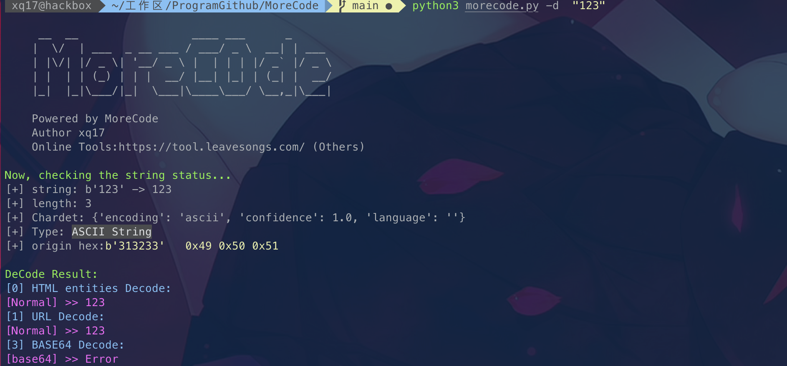

# MoreCode

## Introduce

主要是用于平时渗透测试、ctf之类的小工具，方便用命令行进行操作。

后面我会加上一个setup.py,实现快速自动安装进path,然后直接在命令行使用

`morecode -h`,来使用

>感谢T00ls的兄弟提供一种方案:
>
>```
>vi .bash_profile
>function mc {
>  python3 /path/to/morecode.py $1 $2
>}
>source .bash_profile
>
>mc -e '123'
>mc -d '123'
>```


## 使用说明

` python3 morecode.py -h`

```

     __  __                 ____ ___      _
    |  \/  | ___  _ __ ___ / ___/ _ \  __| | ___
    | |\/| |/ _ \| '__/ _ \ |  | | | |/ _` |/ _ \
    | |  | | (_) | | |  __/ |__| |_| | (_| |  __/
    |_|  |_|\___/|_|  \___|\____\___/ \__,_|\___|

    Powered by MoreCode
    Author xq17
    Online Tools:https://tool.leavesongs.com/ (Others)

usage: morecode.py [-h] [-d] [-e] string

positional arguments:
  string        converted-string

optional arguments:
  -h, --help    show this help message and exit
  -d, --decode  decode string
  -e, --encode  encode string
```


## 效果展示






## TODO

其实还有很多想法,后面慢慢填坑，有个Online在线文件，我也放在工具里面了，方便直接调用。